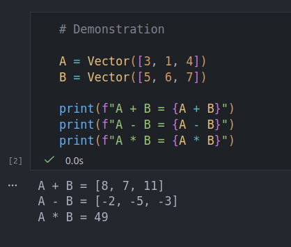

# Project 001: Creating a Script for Basic Vector Operations

In artificial intelligence, vectors are fundamental mathematical concepts used in many AI processes. This project focuses on creating a reusable class and script to perform basic vector operations: addition, subtraction, and dot product.

## What I Learned

I learned how to use Jupyter Notebook, which makes Python programming more convenient. It can run specific portions of code (called cells) while keeping the rest unchanged. I also learned how to create a simple Python class and use operator overloading, allowing operators like `+`, `-`, and `*` to work directly on class objects—for example, `A + B` instead of `A.add(B)`—which is cleaner and more intuitive.

## Challenges

One challenge was using the Jupyter Notebook editor inside Visual Studio Code. I needed to create a Python virtual environment and install `ipykernel` so the Jupyter file could run properly in VS Code.

## Tech Stack

* Python
* Jupyter Notebook

## Preview

## Link

* [GitHub Repo](https://github.com/loselen-lu/100-ai-projects/tree/main/001-vector-operations)